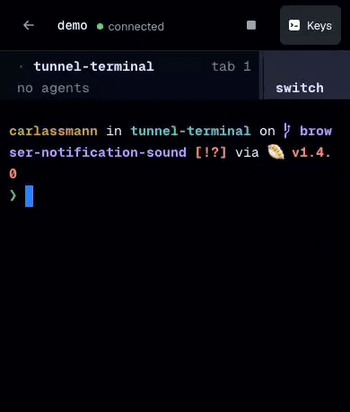

# Herdr Terminal

Herdr. In your browser.

When SSH isn't practical, pick up a [Herdr](https://herdr.dev) session from your
phone or another computer.



Start a new session, rejoin one that's running, or leave it and return later.
That's it.

## Run

Requires [Bun](https://bun.sh) and Herdr on `PATH`.

```sh
bun install
bun start
```

Open http://localhost:8787. If Ghostty is installed, the terminal uses your
Ghostty colors and fonts. On a phone, **Keys** adds Ctrl, Alt, Esc, Tab, and
arrows.

## Remote access

The server listens only on `127.0.0.1`. To reach it remotely, use a named
Cloudflare Tunnel protected by Cloudflare Access. The app has no login of its
own; anyone who reaches it controls a terminal on your machine.

[Set up remote access](./docs/remote-access.md).

[Implementation notes](./docs/implementation.md) cover the details. MIT
licensed; see [LICENSE](./LICENSE).
