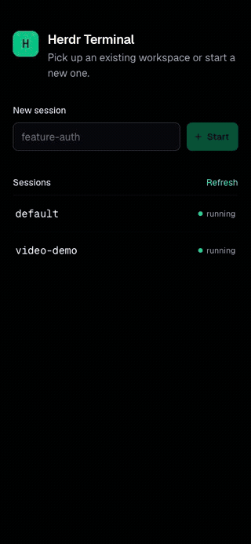

# Herdr Web Terminal



A small, self-hosted web terminal for Herdr. The Bun server binds only to `127.0.0.1`, owns Bun-native PTYs, and serves a React PWA rendered by `ghostty-web`/libghostty WASM.

## Local development

Requirements: macOS, [Bun](https://bun.sh), and `herdr` on `PATH`.

```sh
bun install
bun dev
```

Open <http://localhost:8787>. One Bun process serves the imported HTML/React frontend, hot reloads it during development, and runs the application server on `127.0.0.1:8787`.

The app uses Bun's native HTML bundler, method-specific route table, path parameters, WebSocket upgrade, and file responses. There is no frontend dev server, proxy, or routing framework.

For a production-mode local run without HMR:

```sh
bun start
```

`bun run build` validates Bun's production bundle separately.

Useful checks:

```sh
bun run typecheck
bun test
bun run build
```

## Sessions and persistence

The start screen lists Herdr's named sessions. You can:

- enter a new name to run `herdr --session <name>`;
- select an existing name to run `herdr session attach <name>`;
- use the back button to switch terminals without stopping the prior PTY.

The Bun process keeps each opened PTY alive when Safari disconnects. It retains the latest 1 MiB of raw PTY output and replays it when the browser reconnects. ANSI data is forwarded as arbitrary chunks; the server only watches for DEC private mode switches (mouse reporting, alternate screen, bracketed paste, cursor visibility) and keyboard protocol changes (kitty keyboard flags, xterm modifyOtherKeys) so it can restore them before a replay that no longer starts at the beginning of the stream.

The browser watches the same stream and runs every key press through Ghostty's own key encoder with the negotiated protocol, so Shift+Enter, Alt combinations, and kitty keyboard sequences arrive exactly as they would from a native Ghostty window. Option acts as Alt, like Ghostty's `macos-option-as-alt`. Pastes are wrapped in bracketed paste markers when the application asked for them.

Herdr normally refuses to run nested inside another Herdr pane. The server strips Herdr's nesting markers from the environment of every process it spawns, so it works whether it is launched from a plain shell or from inside Herdr.

The server reads Ghostty's effective local configuration with `ghostty +show-config`. The terminal applies its regular and bold font faces, font size, cell width/height adjustments, window padding (including `window-padding-balance` and `window-padding-color = extend`), cursor style/blink behavior, foreground/background, selection colors, and first 16 ANSI palette colors. Paired `light:…,dark:…` themes follow `window-theme`; `system` follows the browser device's appearance. The app chrome (start screen, header, controls, dialogs) derives its colors from the same resolved theme and switches with it, so the interface stays consistent in light and dark. If the configured font is installed as an OTF, TTF, WOFF, or WOFF2 file in a standard macOS font directory, the server makes it available to the authenticated browser. Set `GHOSTTY_BIN` if the Ghostty executable is installed in a nonstandard location. The configuration is read once per server process, so restart the server after editing Ghostty's config.

`ghostty-web` uses Ghostty's terminal parser but a browser Canvas renderer, not Ghostty's native Metal renderer. Font rasterization, ligature shaping, custom shaders, macOS-only font thickening, and some cursor/cell metric details cannot be pixel-identical to the native application.

`ghostty-web@0.4.0` does not expose cell-metric adjustments. This project carries a small [`patchedDependencies`](./patches/ghostty-web@0.4.0.patch) patch that applies Ghostty's pixel/percentage width and height adjustments during font measurement and restores the default mouse cursor when no link is hovered. Remove it when upstream exposes equivalent options.

Herdr remains the source of durable session state. If the Bun server restarts, its PTYs and replay buffers are lost, but Herdr's named sessions continue running and appear on the start screen for re-attachment. No tmux-like persistence layer is added.

Transport is WebSocket first. After repeated WebSocket connection failures the browser falls back to SSE for output and `POST` for input/resize. Network and foreground changes trigger automatic reconnection.

## iPhone controls and PWA

The terminal uses the full available viewport, including iPhone safe areas. Tap the terminal to focus the software keyboard. The top-right **Keys** menu includes `Ctrl`, `Alt`, `Esc`, `Tab`, and arrow keys.

When an application enables terminal mouse reporting, clicks, taps, drags, and wheel events are encoded as terminal cell events and forwarded to its PTY. This makes Herdr's TUI directly operable without pretending its painted terminal cells are DOM controls. Hold Shift while clicking or dragging to bypass mouse reporting and select text, as in Ghostty.

`Ctrl` and `Alt` latch for the next key. For example, tap `Ctrl`, then type `C` or `B` on the software keyboard. The modifier clears after that input.

To install: open the HTTPS hostname in Safari, tap Share, choose **Add to Home Screen**, then open Herdr from the new Home Screen icon. Standalone mode and status-bar metadata are included.

## Cloudflare Tunnel

The app has no Cloudflare-specific code. Keep it on loopback and let `cloudflared` make the outbound connection.

Install and authenticate with the Cloudflare zone that owns the hostname:

```sh
brew install cloudflared
cloudflared tunnel login
cloudflared tunnel create herdr-terminal
cloudflared tunnel route dns herdr-terminal herdr
```

Create `~/.cloudflared/herdr-terminal.yml`, replacing the UUID and account path:

```yaml
tunnel: YOUR-TUNNEL-UUID
credentials-file: /Users/YOU/.cloudflared/YOUR-TUNNEL-UUID.json

ingress:
  - hostname: herdr.example.com
    service: http://127.0.0.1:8787
  - service: http_status:404
```

Because the browser then reaches the app under a public hostname, list that hostname in `PUBLIC_HOSTS` so the server accepts its requests:

```sh
PUBLIC_HOSTS=herdr.example.com bun start
```

For development behind a proxy, set `PUBLIC_HOSTS` in `.env.local` and run `work restart web`. Browser HMR is disabled for that run because Bun's HMR server rejects non-local hostnames; server hot reload and manual browser refresh still work.

Validate and run:

```sh
cloudflared tunnel --config ~/.cloudflared/herdr-terminal.yml ingress validate
work run tunnel
```

Cloudflare Tunnel supports WebSockets without an application change. When a network blocks WebSockets, the client falls back to SSE, and when SSE stalls too, to long polling. Cloudflare documents that Quick Tunnels do not support SSE, so on a Quick Tunnel the second fallback is the one that carries traffic. Prefer a named tunnel: it supports every transport and is the only kind you can put behind Cloudflare Access. See Cloudflare's [locally-managed tunnel guide](https://developers.cloudflare.com/tunnel/advanced/local-management/create-local-tunnel/), [configuration reference](https://developers.cloudflare.com/tunnel/advanced/local-management/configuration-file/), and [Tunnel FAQ](https://developers.cloudflare.com/cloudflare-one/faq/cloudflare-tunnels-faq/).

To skip WebSocket attempts and try one persistent HTTP output stream, open `https://herdr.carlassmann.com/?transport=sse`. This keeps input batched over POST while avoiding repeated output polls. If SSE fails or stops delivering heartbeats, the browser falls back to polling. Use the connection logs to confirm which transport actually connected.

For networks that block streaming connections, open `https://herdr.carlassmann.com/?transport=poll` to use HTTP polling immediately. Otherwise, WebSocket and SSE attempts each time out after five seconds without a first message. SSE also falls back if its heartbeats stop for 35 seconds. Reconnecting after switching tabs preserves the selected fallback.

Run `work logs web` to inspect browser connection reports. Lines prefixed with `[connection]` show the session, transport, state, and failure reason when available. Reports contain no terminal input or output and require the browser's HTTP requests to reach the server.

### Latency diagnostics

HTTP input, resize, and polling requests carry a browser ID, request ID, and completed timing samples. Samples ride on the next request, with a beacon flush at most every 10 seconds while samples are pending, plus a flush on transport close. WebSocket messages and SSE output delivery are not timed by this instrumentation.

Read aggregates from the server:

```sh
curl -s 'http://127.0.0.1:8787/api/diagnostics?session=default'
```

The same endpoint is available through Cloudflare Access at `https://herdr.carlassmann.com/api/diagnostics?session=default`. Omit `session` to inspect every browser and session. It uses the existing request-origin guard.

Each group exposes count, mean, median, p95, and maximum, plus the latest 20 correlated requests:

| Metric | Meaning |
| --- | --- |
| `queueMs` | Time the oldest input event in a batch waited before sending. |
| `requestMs` | Browser elapsed time through response consumption, including JSON decoding for polls. |
| `serverMs` | Server handler duration, including intentional long-poll waiting. |
| `overheadMs` | Request duration minus server duration, clamped to zero. Includes network, proxy, transfer, and browser scheduling/decoding. |
| `headersMs` / `consumeMs` | Time until fetch resolves with headers, then time consuming the response. These include browser scheduling. |
| `setupMs` | Resource start to request start, including connection setup and browser queuing. |
| `dnsMs` / `connectMs` | DNS and connection setup durations. Connection timing includes TLS where applicable. |
| `firstByteOverheadMs` | Browser request-to-first-byte time minus server handling. Mostly request upload and network/proxy waiting. |
| `transferMs` | First response byte to last response byte. |
| `afterResponseMs` | Last byte received to response processing completion in JavaScript. |
| `batchSize` | Number of input events combined, or resize events coalesced. Events include terminal protocol replies and mouse events. |
| `inputBytes` / `outputBytes` | UTF-8 terminal payload size, excluding HTTP and JSON overhead. |

Groups also list negotiated HTTP protocols when the browser exposes them. Detailed phases use the browser's [Resource Timing API](https://www.w3.org/TR/resource-timing/). Observations are bounded and joined to requests before reporting; unsupported or unavailable phases remain absent. No extra probe requests are generated. `dnsMs` and `connectMs` are parts of `setupMs`; do not add overlapping metrics together.

Durations use each machine's monotonic clock. No synchronized clocks are required; timestamps identify when the server observed a request. These measurements do not measure screen paint or prove which output was caused by a particular key. A long idle poll is expected; inspect `overheadMs` separately from `serverMs`.

Storage is in memory, limited to 32 browser/session pairs and 512 requests per pair from the last 10 minutes. Restarting the server clears it. Reports are best effort; requests whose browser reports never arrive still contribute server timings. Only validated timing fields and IDs are retained, never terminal contents.

### Cloudflare Access

Before using the public hostname, create a **Self-hosted** Access application for `herdr.example.com` under Zero Trust → Access controls → Applications. Add an Allow policy limited to your identity or identity-provider group. Cloudflare's [self-hosted application guide](https://developers.cloudflare.com/cloudflare-one/access-controls/applications/http-apps/self-hosted-public-app/) covers the dashboard flow.

The current deployment uses `https://herdr.carlassmann.com/`. Cloudflare Access requires an email one-time PIN and an allowlist configured in Cloudflare, outside this repo.

Do not add an Access bypass policy. This application intentionally has no account system; anyone who reaches it can control Herdr and therefore a local terminal.

## API

- `GET /api/sessions`
- `GET /api/appearance`
- `GET /api/appearance/font`
- `POST /api/sessions` with `{ "name": "work", "mode": "create" | "attach" }`
- `GET /api/session/:id/ws`
- `GET /api/session/:id/events`
- `GET /api/session/:id/poll`
- `POST /api/session/:id/input`
- `POST /api/session/:id/resize`
- `POST /api/session/:id/connection` for connection diagnostics
- `POST /api/session/:id/diagnostics` for timing reports
- `GET /api/diagnostics` for aggregated timings

WebSocket client messages are `input` or `resize`; server messages are `output` or `status`, matching `src/shared/protocol.ts`.

## Limitations

- Single trusted operator; no in-app authentication or authorization. The server only answers requests whose `Host` is a loopback name or listed in the comma-separated `PUBLIC_HOSTS`, and whose `Origin`, when sent, matches that host. This blocks DNS rebinding, but it is not authentication: keep Cloudflare Access in front of any public hostname.
- Session registry and 1 MiB replay buffers live in Bun memory.
- If two browsers attach to one web session, both can send input and the latest resize wins.
- Herdr's own session history/state survives app-server restarts; the browser terminal's prior scrollback does not.
- iOS may suspend network activity in the background. Herdr continues; output resumes after reconnection.
- Fallback transports send input over `POST` and receive output over SSE or long polling. The first input sends immediately. Up to two HTTP input/resize requests can overlap, with at least 50 ms between sends. Waiting events are batched, and the server applies numbered batches in order even if requests arrive out of order. A missing batch fails the stream and reconnects; uncertain input is not replayed automatically. Once the client has fallen back it stays there until the page reloads.
- Ghostty settings without a browser-renderer equivalent, including custom shaders and macOS font thickening, are ignored.
